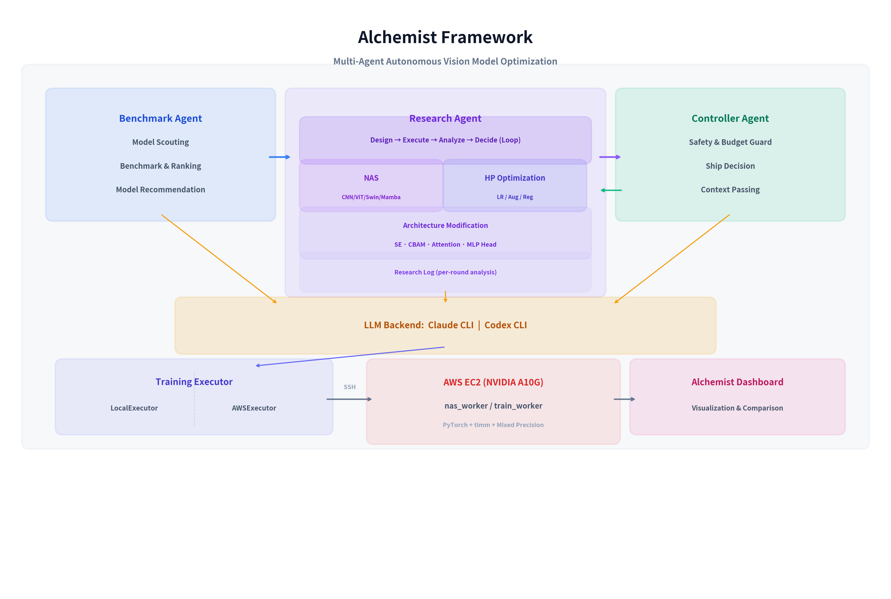

# Alchemist

**LLM 기반 다중 에이전트 자율 협업을 통한 비전 모델 탐색 및 학습 최적화 프레임워크**

Alchemist는 3개의 AI 에이전트(Benchmark, Research, Controller)가 자율적으로 협업하여 비전 모델의 아키텍처 탐색, 하이퍼파라미터 최적화, 학습 전략 설계를 수행하는 AutoML 연구 하네스입니다.

---

## Architecture



<details>
<summary>Text version</summary>

```
┌─────────────────────────────────────────────────────────────────────┐
│                        Alchemist Framework                          │
│                                                                     │
│  ┌───────────────┐   ┌───────────────────┐   ┌──────────────────┐  │
│  │  Benchmark    │   │    Research        │   │   Controller     │  │
│  │  Agent        │   │    Agent           │   │   Agent          │  │
│  │               │   │                    │   │                  │  │
│  │  • 모델 탐색  │──▶│  • 실험 설계       │◀──│  • 안전/예산 관리│  │
│  │  • 벤치마크   │   │  • 학습 실행       │──▶│  • Ship 판정    │  │
│  │  • 리더보드   │   │  • 자체 분석       │   │  • 품질 기준    │  │
│  │  • 모델 추천  │   │  • 반복 개선       │   │                  │  │
│  └───────┬───────┘   └─────────┬─────────┘   └──────────────────┘  │
│          │                     │                                    │
│          │     LLM Backend (Claude CLI / Codex CLI)                 │
│          │     ┌─────────────────────────────────┐                  │
│          └────▶│  claude -p / codex exec          │◀────────────────│
│                └─────────────────────────────────┘                  │
│                                                                     │
│  ┌─────────────────────────────────────────────────────────────┐   │
│  │                    Training Executor                         │   │
│  │                                                              │   │
│  │  LocalExecutor          │    AWSExecutor                     │   │
│  │  (시뮬레이션)           │    (SSH → EC2 GPU)                 │   │
│  └──────────────────────────┼──────────────────────────────────┘   │
│                              │                                      │
└──────────────────────────────┼──────────────────────────────────────┘
                               │ SSH + SCP
                               ▼
                ┌────────────────────────────┐
                │      AWS EC2 (A10G GPU)    │
                │                            │
                │  nas_worker.py             │
                │  train_worker.py           │
                │  • PyTorch + timm          │
                │  • Mixed Precision         │
                │  • NAS / HP Optimization   │
                └──────────────┬─────────────┘
                               │
                               ▼
                ┌────────────────────────────┐
                │   Alchemist Dashboard      │
                │   (결과 시각화 + 비교)     │
                └────────────────────────────┘
```

### Research Agent 자율 반복 루프

Research Agent는 HP 최적화와 NAS를 모두 포함하는 자율 연구 루프를 수행합니다.

```
┌───────────────────────────────────────────────────────────────────┐
│                        Research Agent                              │
│                                                                    │
│  ┌─────────────────────────────────────────────────────────────┐  │
│  │  자율 반복 루프 (Round 1 ~ N)                                │  │
│  │                                                              │  │
│  │  실험 설계 ──▶ 학습 실행 ──▶ LLM 자체 분석 ──▶ 계속 판단    │  │
│  │      │                            │               │          │  │
│  │      │   "lr=0.001 최적,          │    Yes ────────┤          │  │
│  │      │    freeze=False 효과적,    │               │          │  │
│  │      │    LoRA 미탐색"            │    No ──▶ 최종 결과      │  │
│  │      ▼                            │                          │  │
│  │  분석 기반 재설계 ──▶ 재실행 ──▶ ...                         │  │
│  └─────────────────────────────────────────────────────────────┘  │
│                                                                    │
│  ┌─────────────────────────────────────────────────────────────┐  │
│  │  NAS (Neural Architecture Search)                            │  │
│  │                                                              │  │
│  │  Phase 1: Architecture Exploration (다중 backbone 탐색)      │  │
│  │  ┌────────────────────────────────────────────┐              │  │
│  │  │ CNN: ResNet, WideResNet, ResNeXt, ConvNeXt │              │  │
│  │  │ ViT: ViT, DeiT, Swin Transformer          │ Top-K 선정  │  │
│  │  │ SSM: MambaOut, Vision Mamba                ├─────┐       │  │
│  │  │ Etc: EfficientNet, RegNet                  │     │       │  │
│  │  └────────────────────────────────────────────┘     │       │  │
│  │                                                      ▼       │  │
│  │  Phase 2: HP Optimization (Top backbone 집중 탐색)           │  │
│  │  ┌────────────────────────────────────────────┐              │  │
│  │  │ LR 전략, Head 변형, Augmentation 조합      │              │  │
│  │  │ 아키텍처 수정 (SE, CBAM, Attention)        │              │  │
│  │  └────────────────────────────────────────────┘              │  │
│  └─────────────────────────────────────────────────────────────┘  │
└───────────────────────────────────────────────────────────────────┘
```

</details>

---

## Features

### 에이전트 시스템
- **Benchmark Agent**: 다중 backbone 탐색 + 벤치마크 순위화 + 모델 추천
- **Research Agent**: 자율 실험 설계 → 실행 → LLM 분석 → 반복 개선 루프
  - HP 최적화: LR, augmentation, regularization 탐색
  - NAS: 다중 backbone 탐색 (CNN/ViT/Swin/Mamba) → Top-K 선정 → 집중 최적화
  - 아키텍처 수정: SE Block, CBAM, Attention 주입, Head 변형
- **Controller Agent**: 예산/안전 관리, Ship 판정, 에이전트 간 컨텍스트 전달

### LLM Backend
- **Claude CLI** (`claude -p`): Anthropic Claude 모델
- **Codex CLI** (`codex exec`): OpenAI Codex 모델
- API 키 없이 로컬 인증된 CLI 활용

### 학습 기법
- **LR 스케줄링**: OneCycleLR, CosineAnnealing, CosineWarmRestarts, Warmup+Cosine
- **정규화**: Mixup, CutMix, RandAugment, RandomErasing, Label Smoothing, Dropout
- **최적화**: AdamW, Differential LR (backbone/head), Gradient Clipping, Mixed Precision (AMP)
- **EMA**: Exponential Moving Average (batch-level update)
- **아키텍처 수정**: SE Block, CBAM, Self-Attention 주입, MLP Head

### Research Agent 탐색 범위
- **CNN**: ResNet, WideResNet, ResNeXt, EfficientNet, ConvNeXt, RegNet
- **Transformer**: ViT, DeiT, Swin Transformer
- **SSM/Mamba**: MambaOut, Vision Mamba
- **탐색 전략**: Architecture Exploration → Top-K 선정 → HP Optimization → Final Long Training

### AWS 연동
- **AWSExecutor**: SSH로 EC2 GPU 인스턴스에 학습 작업 제출 + 폴링
- **train_worker.py / nas_worker.py**: EC2에서 실행되는 독립 학습 워커
- S3 코드/데이터 동기화

### Dashboard 연동
- 학습 결과를 [Alchemist Dashboard](https://github.com/haejune-lee98/Alchemist_Dashboard) JSON 포맷으로 자동 변환
- Fine-tuning / Linear Probe 결과 분리 관리

---

## Results (CIFAR-100)

### Fine-tuning (Best per architecture family)

| Model | Type | Params | Top-1 Acc | Epochs |
|-------|------|--------|-----------|--------|
| ViT-Base/16 | ViT | 86M | **93.46%** | 10 |
| ViT-Small/16 | ViT | 22M | 91.89% | 15 |
| ConvNeXt-Tiny | CNN | 28M | 90.87% | 40 |
| DeiT-Base | ViT | 86M | 90.70% | 10 |
| RegNetY-032 | CNN | 19M | 88.97% | 20 |
| ResNet-50 | CNN | 26M | 86.77% | 50 |

### Linear Probe (Best per architecture family)

| Model | Type | Params | Top-1 Acc |
|-------|------|--------|-----------|
| ViT-Base/16 | ViT | 86M | **80.37%** |
| ConvNeXt-Small | CNN | 50M | 79.65% |
| ViT-Small/16 | ViT | 22M | 77.89% |
| DeiT-Base | ViT | 86M | 78.17% |

---

## Quick Start

### 로컬 실행 (Mock LLM)
```bash
python main.py run --task-name cifar100 --num-classes 100 --max-trials 4 --max-rounds 3
```

### Claude CLI 사용
```bash
python main.py run --llm claude --llm-model sonnet --task-name cifar100 --num-classes 100
```

### AWS GPU 학습
```bash
python main.py run --llm claude --llm-model sonnet \
    --executor aws \
    --aws-host ubuntu@ec2-xx.compute.amazonaws.com \
    --aws-key ~/.ssh/my-key.pem \
    --task-name cifar100 --num-classes 100
```

### Dashboard 데이터 생성
```bash
python export_dashboard.py --llm claude --output /path/to/dashboard/data/alchemist_v2.json
```

---

## Project Structure

```
alchemist/
├── alchemist/                  # Core package
│   ├── agents/
│   │   ├── benchmark.py        # Benchmark Agent (모델 탐색 + 순위화)
│   │   ├── research.py         # Research Agent (자율 실험 루프)
│   │   ├── controller.py       # Controller Agent (안전 + Ship 판정)
│   │   └── protocol.py         # 에이전트 간 메시지 프로토콜
│   ├── core/
│   │   ├── executor.py         # TrainingExecutor (Local / AWS)
│   │   ├── llm.py              # LLM Client (Claude CLI / Codex CLI / Mock)
│   │   ├── schemas.py          # 데이터 스키마
│   │   └── utils.py            # 유틸리티
│   └── harness.py              # ThreeAgentHarness (오케스트레이터)
├── main.py                     # CLI 진입점
├── export_dashboard.py         # Dashboard JSON 변환
├── train_worker.py             # EC2 학습 워커 (ResNet 중심)
├── nas_worker.py               # EC2 NAS 워커 (ViT/Swin/Mamba 포함)
├── nas_batch.sh                # NAS 배치 실행 스크립트
├── vit_batch_v2.sh             # ViT/Swin/Mamba 배치 스크립트
├── tests/                      # Unit + Integration 테스트
├── docs/
│   ├── DEV_REPORT.md           # 개발 리포트 (세션별 토큰/비용 추적)
│   ├── PDR.md                  # Preliminary Design Review
│   └── TDD.md                  # Test-Driven Design
└── logs/                       # 실험 로그 + 결과 JSON
```

---

## Tech Stack

- **Python** 3.10+
- **PyTorch** 2.x + CUDA
- **timm** (모델 zoo)
- **Claude Code CLI** / **Codex CLI** (LLM backend)
- **AWS EC2** g5.xlarge (NVIDIA A10G 24GB)
- **S3** (코드/데이터 저장)

---

## License

MIT
